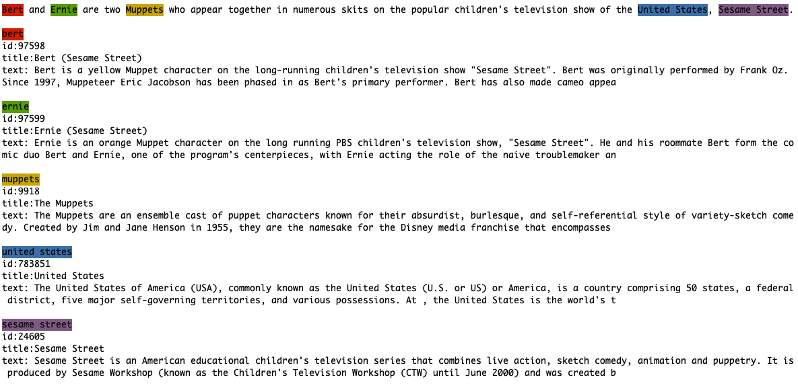

--------------------------------------------------------------------------------

BLINK is an Entity Linking python library that uses Wikipedia as the target knowledge base.

The process of linking entities to Wikipedia is also known as [Wikification](https://en.wikipedia.org/wiki/Wikification).


### news
- (September 2020) added [ELQ](https://github.com/facebookresearch/BLINK/tree/master/elq) - end-to-end entity linking on questions
- (3 July 2020) added [FAISS](https://github.com/facebookresearch/faiss) support in BLINK - efficient exact/approximate retrieval


## BLINK architecture

The BLINK architecture is described in the following paper:

```bibtex
@inproceedings{wu2019zero,
 title={Zero-shot Entity Linking with Dense Entity Retrieval},
 author={Ledell Wu, Fabio Petroni, Martin Josifoski, Sebastian Riedel, Luke Zettlemoyer},
 booktitle={EMNLP},
 year={2020}
}
```

[https://arxiv.org/pdf/1911.03814.pdf](https://arxiv.org/pdf/1911.03814.pdf)

In a nutshell, BLINK uses a two stages approach for entity linking, based on fine-tuned BERT architectures. In the first stage, BLINK performs retrieval in a dense space defined by a bi-encoder that independently embeds the mention context and the entity descriptions. Each candidate is then examined more carefully with a cross-encoder, that concatenates the mention and entity text. BLINK achieves state-of-the-art results on multiple datasets.


## ELQ architecture

ELQ does end-to-end entity linking on questions. The ELQ architecture is described in the following paper:

```bibtex
@inproceedings{li2020efficient,
 title={Efficient One-Pass End-to-End Entity Linking for Questions},
 author={Li, Belinda Z. and Min, Sewon and Iyer, Srinivasan and Mehdad, Yashar and Yih, Wen-tau},
 booktitle={EMNLP},
 year={2020}
}
```

[https://arxiv.org/pdf/2010.02413.pdf](https://arxiv.org/pdf/2010.02413.pdf)

For more detail on how to run ELQ, refer to the [ELQ README](https://github.com/facebookresearch/BLINK/tree/master/elq).


## Use BLINK

### 1. Create conda environment and install requirements

(optional) It might be a good idea to use a separate conda environment. It can be created by running:
```
conda create -n blink37 -y python=3.7 && conda activate blink37
pip install -r requirements.txt
```

### 2. Download the BLINK models

The BLINK pretrained models can be downloaded using the following script:
```console
chmod +x download_blink_models.sh
./download_blink_models.sh
```

We additionally provide a [FAISS](https://github.com/facebookresearch/faiss) indexer in BLINK, which enables efficient exact/approximate retrieval for biencoder model.

- [flat index](http://dl.fbaipublicfiles.com/BLINK//faiss_flat_index.pkl)
- [hnsw (approximate search) index](http://dl.fbaipublicfiles.com/BLINK/faiss_hnsw_index.pkl)


To build and save FAISS (exact search) index yourself, run
`python blink/build_faiss_index.py --output_path models/faiss_flat_index.pkl`


### 3. Use BLINK interactively
A quick way to explore the BLINK linking capabilities is through the `main_dense` interactive script. BLINK uses [Flair](https://github.com/flairNLP/flair) for Named Entity Recognition (NER) to obtain entity mentions from input text, then run entity linking. 

```console
python blink/main_dense.py -i
```

Fast mode: in the fast mode the model only uses the bi-encoder, which is much faster (accuracy drops slightly, see details in "Benchmarking BLINK" section). 

```console
python blink/main_dense.py -i --fast
```

To run BLINK with saved FAISS index, run:
```console
python blink/main_dense.py --faiss_index flat --index_path models/faiss_flat_index.pkl
```
or 
```console
python blink/main_dense.py --faiss_index hnsw --index_path models/faiss_hnsw_index.pkl
```


Example: 
```console
Bert and Ernie are two Muppets who appear together in numerous skits on the popular children's television show of the United States, Sesame Street.
```
Output:



Note: passing ```--show_url``` argument will show the Wikipedia url of each entity. The id number displayed corresponds to the order of entities in the ```entity.jsonl``` file downloaded from ```./download_models.sh``` (starts from 0). The ```entity.jsonl``` file contains information of one entity per row (includes Wikipedia url, title, text, etc.).

### 4. Use BLINK in your codebase

```console
pip install -e git+git@github.com:facebookresearch/BLINK#egg=BLINK
```

```python
import blink.main_dense as main_dense
import argparse

models_path = "models/" # the path where you stored the BLINK models

config = {
    "test_entities": None,
    "test_mentions": None,
    "interactive": False,
    "top_k": 10,
    "biencoder_model": models_path+"biencoder_wiki_large.bin",
    "biencoder_config": models_path+"biencoder_wiki_large.json",
    "entity_catalogue": models_path+"entity.jsonl",
    "entity_encoding": models_path+"all_entities_large.t7",
    "crossencoder_model": models_path+"crossencoder_wiki_large.bin",
    "crossencoder_config": models_path+"crossencoder_wiki_large.json",
    "fast": False, # set this to be true if speed is a concern
    "output_path": "logs/" # logging directory
}

args = argparse.Namespace(**config)

models = main_dense.load_models(args, logger=None)

data_to_link = [ {
                    "id": 0,
                    "label": "unknown",
                    "label_id": -1,
                    "context_left": "".lower(),
                    "mention": "Shakespeare".lower(),
                    "context_right": "'s account of the Roman general Julius Caesar's murder by his friend Brutus is a meditation on duty.".lower(),
                },
                {
                    "id": 1,
                    "label": "unknown",
                    "label_id": -1,
                    "context_left": "Shakespeare's account of the Roman general".lower(),
                    "mention": "Julius Caesar".lower(),
                    "context_right": "'s murder by his friend Brutus is a meditation on duty.".lower(),
                }
                ]

_, _, _, _, _, predictions, scores, = main_dense.run(args, None, *models, test_data=data_to_link)

```

## Benchmarking BLINK

We provide scripts to benchmark BLINK against popular Entity Linking datasets.
Note that our scripts evaluate BLINK in a full Wikipedia setting, that is, the BLINK entity library contains all Wikipedia pages.

To benchmark BLINK run the following commands:

```console
./scripts/get_train_and_benchmark_data.sh
python scripts/create_BLINK_benchmark_data.py
python blink/run_benchmark.py
```

The following table summarizes the performance of BLINK for the considered datasets.

| dataset | biencoder accuracy (fast mode) | biencoder recall@10 | biencoder recall@30 | biencoder recall@100 | crossencoder normalized accuracy | overall unnormalized accuracy | support |
| ------------- | ------------- | ------------- | ------------- | ------------- | ------------- |  ------------- |  ------------- |
| AIDA-YAGO2 testa | 0.8145 | 0.9425 | 0.9639 | 0.9826 | 0.8700 | 0.8212 | 4766 |
| AIDA-YAGO2 testb | 0.7951 | 0.9238 | 0.9487 | 0.9663 | 0.8669 | 0.8027 | 4446 |
| ACE 2004 | 0.8443 | 0.9795| 0.9836 | 0.9836 | 0.8870 | 0.8689 | 244 |
| aquaint | 0.8662 | 0.9618| 0.9765| 0.9897 | 0.8889 | 0.8588 | 680 |
| clueweb - WNED-CWEB (CWEB) | 0.6747 | 0.8223 | 0.8609 | 0.8868 | 0.826 | 0.6825 | 10491 |
| msnbc | 0.8428 | 0.9303 | 0.9546 | 0.9676| 0.9031 | 0.8509 | 617 |
| wikipedia - WNED-WIKI (WIKI) | 0.7976 | 0.9347 | 0.9546 | 0.9776| 0.8609 | 0.8067 | 6383 |
| TAC-KBP 2010<sup>1</sup> | 0.8898 | 0.9549 | 0.9706 | 0.9843 | 0.9517 | 0.9087 | 1019 |

<sup>1</sup> Licensed dataset available [here](https://catalog.ldc.upenn.edu/LDC2018T16).


## The BLINK knowledge base
The BLINK knowledge base (entity library) is based on the 2019/08/01 Wikipedia dump, downloadable in its raw format from [http://dl.fbaipublicfiles.com/BLINK/enwiki-pages-articles.xml.bz2](http://dl.fbaipublicfiles.com/BLINK/enwiki-pages-articles.xml.bz2)

## BLINK with solr as IR system
The first version of BLINK uses an [Apache Solr](https://lucene.apache.org/solr) based Information Retrieval system in combination with a BERT based cross-encoder.
This IR-based version is now deprecated since it's outperformed by the current BLINK architecture.
If you are interested in the old version, please refer to [this README](blink/candidate_retrieval/README.md).

## Troubleshooting

If the module cannot be found, preface the python command with `PYTHONPATH=.`

## License
BLINK is MIT licensed. See the [LICENSE](LICENSE) file for details.
